# IT Helpdesk

> **Portfolio Showcase Repository**

IT Helpdesk is a full-stack IT service-management platform built with Laravel and React.

This public repository is a curated showcase of a larger private commercial project. It contains selected architecture and code samples for recruiting, portfolio, and demonstration purposes. It is intentionally not the complete deployable source code.

## Project Scope

The full platform includes:

- Ticket lifecycle management
- Role-based access control
- Asset management
- SLA tracking
- Approval workflows
- Automation rules
- Knowledge base
- Email-to-ticket processing
- Microsoft Entra ID SSO
- Audit logging
- Advanced analytics and reporting
- Real-time notifications
- Multilingual support

## Technology

- Laravel 12
- PHP
- React
- Vite
- Tailwind CSS
- MySQL
- Laravel Sanctum
- Laravel Reverb
- Microsoft Entra ID
- Recharts

## 🎥 Video Demos
Click and play on youtbe!

### User Dashboard
Experience the end-user workflow for creating requests, tracking ticket progress, reviewing responses, accessing the knowledge base, and managing personal preferences.

### Admin Dashboard
Explore the full administrative experience, including user management, role and permission control, asset management, automation, audit logs, reporting, and system configuration.

### Manager Dashboard
See how managers monitor workloads, review approvals, manage ticket activity, access reports, and use advanced analytics to understand service performance.

## Product Screenshots

### Login
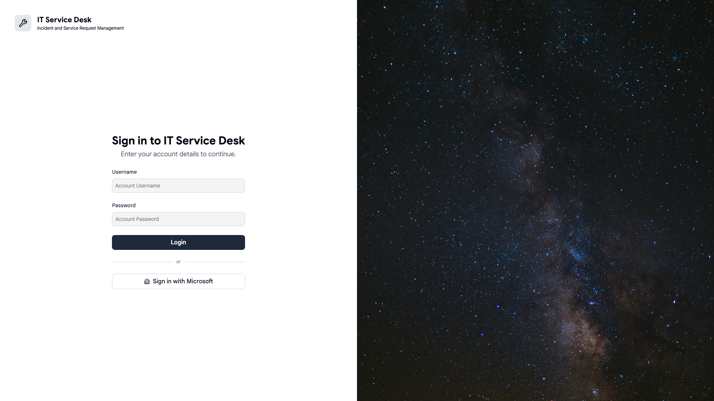

### User Experience
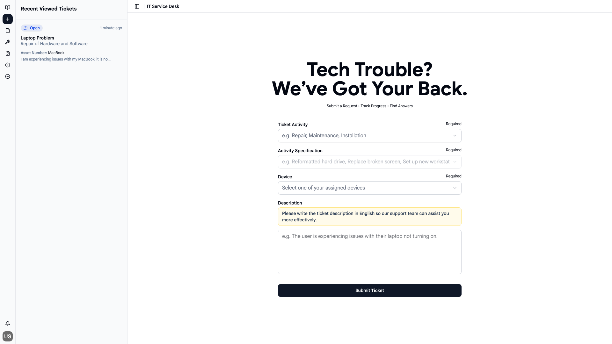

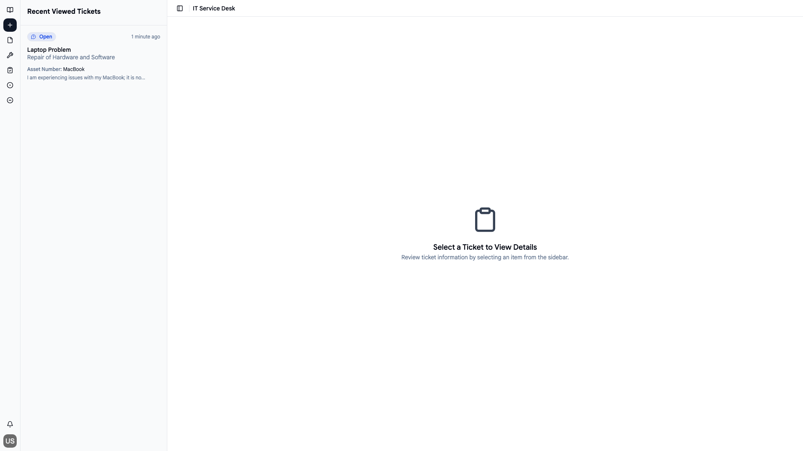

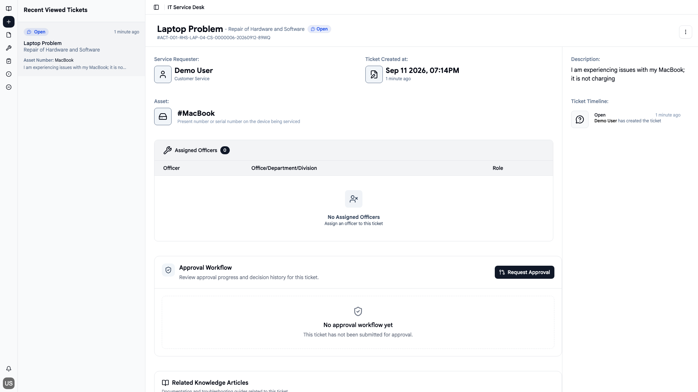

### Knowledge Base
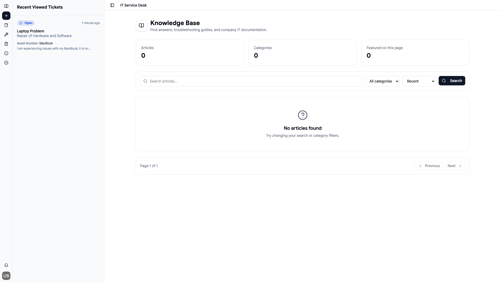

### Manager Operations
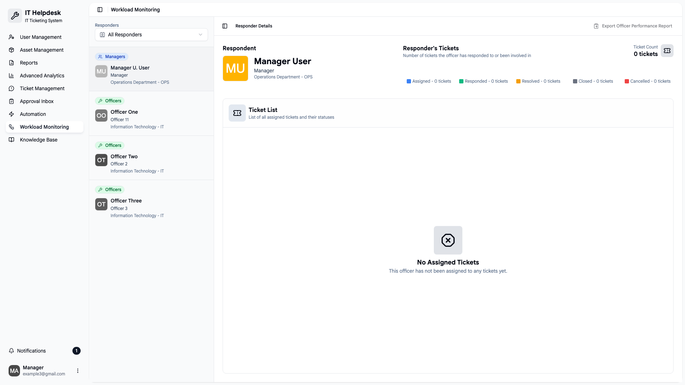

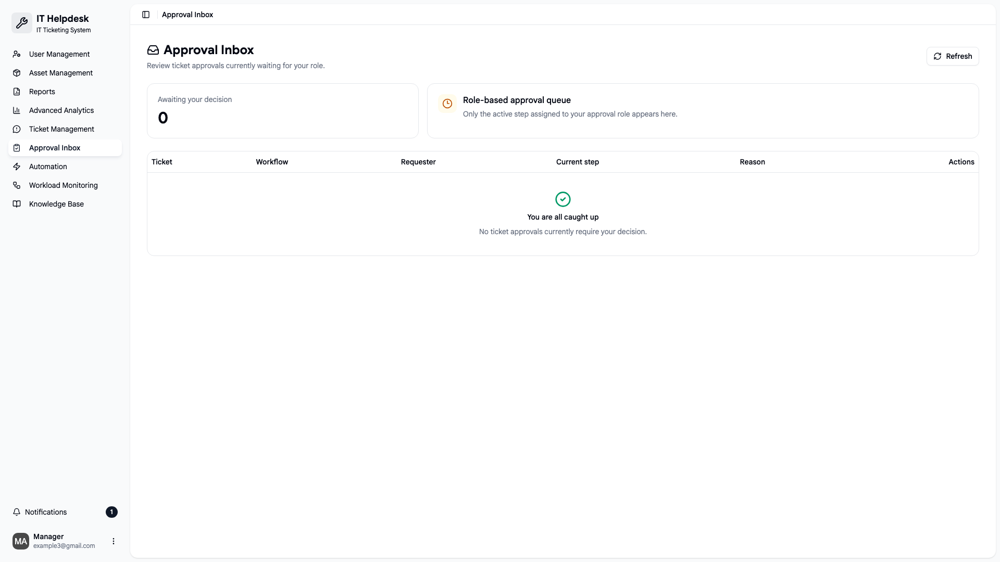

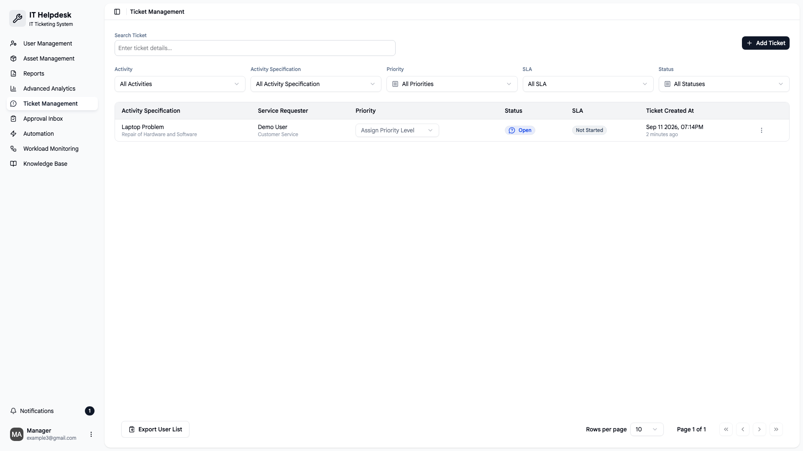

### Analytics & Reporting
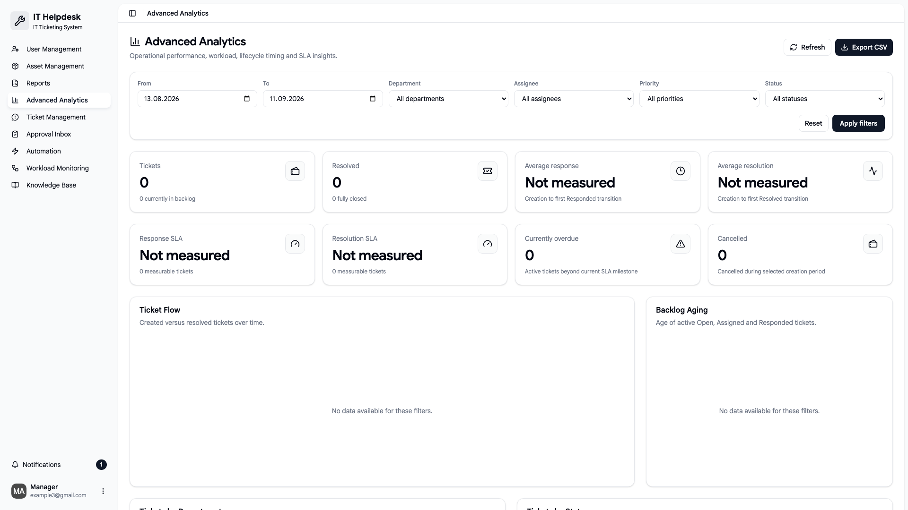

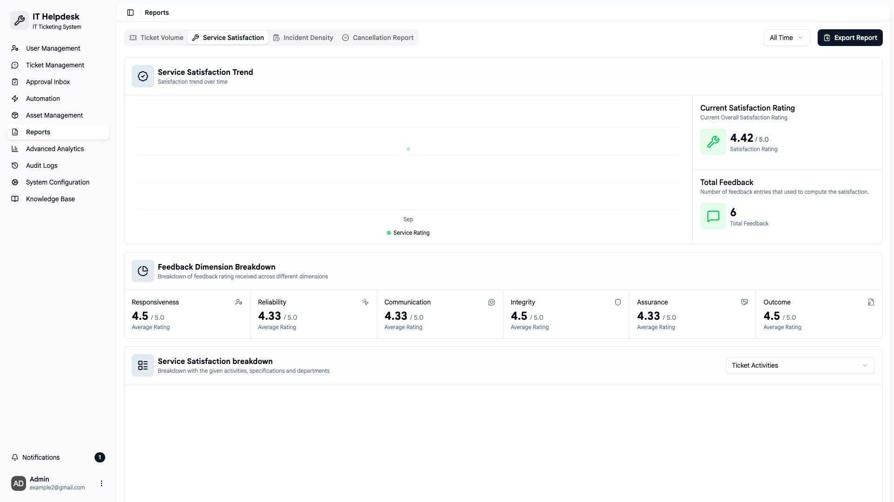

### Administration
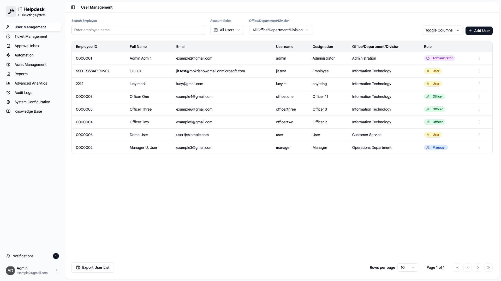

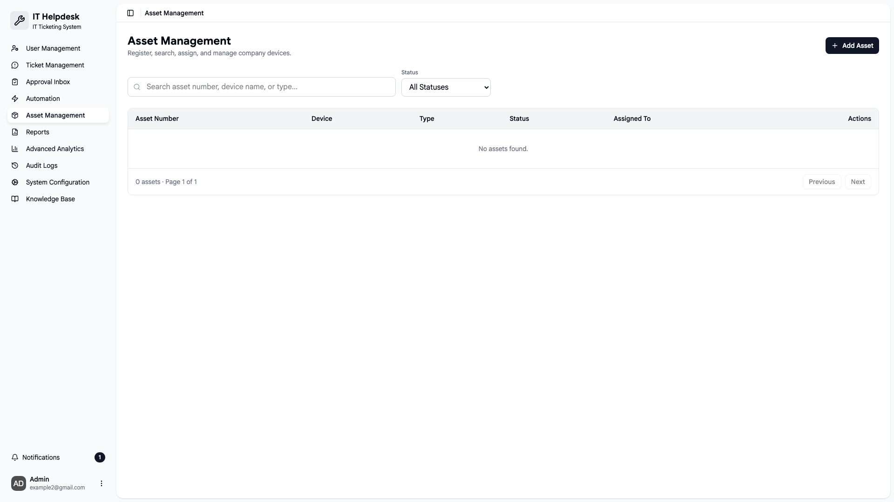

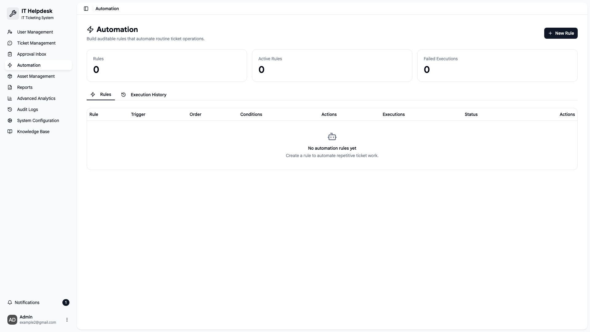

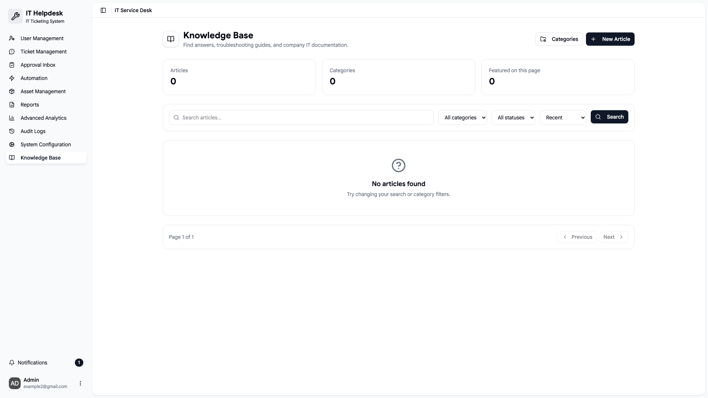

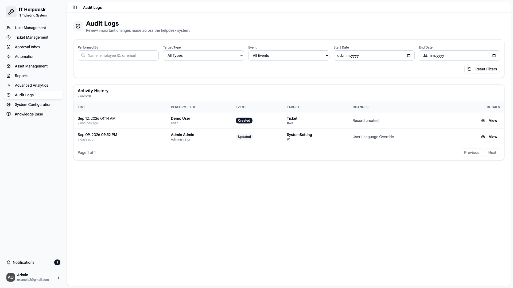

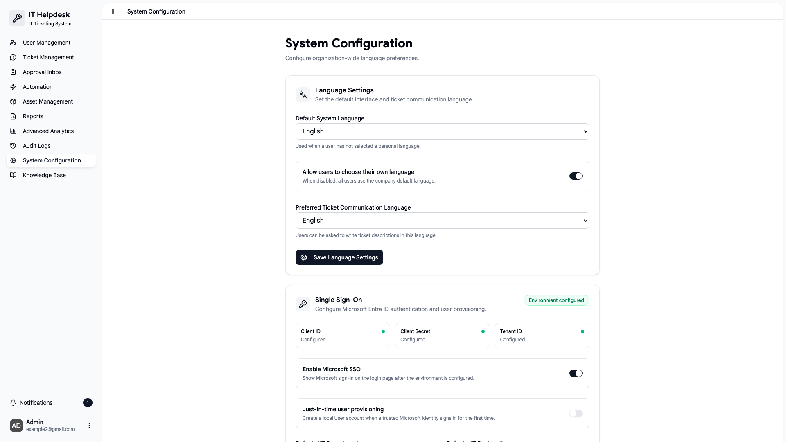

### Multilingual Interface
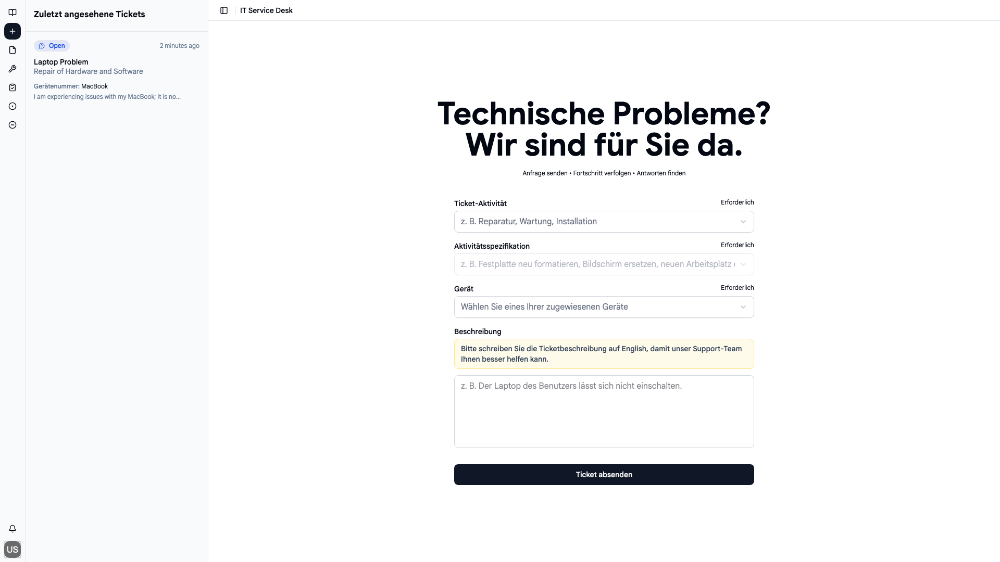

## Showcase Notice

This repository contains selected code samples only.

The complete production source code, production configuration, credentials, customer data, and operational infrastructure are not included.

## Author

**Zakaria Mokri**

GitHub: [zakaria-mokri](https://github.com/zakaria-mokri)

For professional or licensing inquiries:

**Almokrizakaria@gmail.com**

## License

Copyright © 2026 Zakaria Mokri. All Rights Reserved.

This repository is proprietary software published for portfolio and evaluation purposes only.

See [LICENSE](LICENSE) for details.